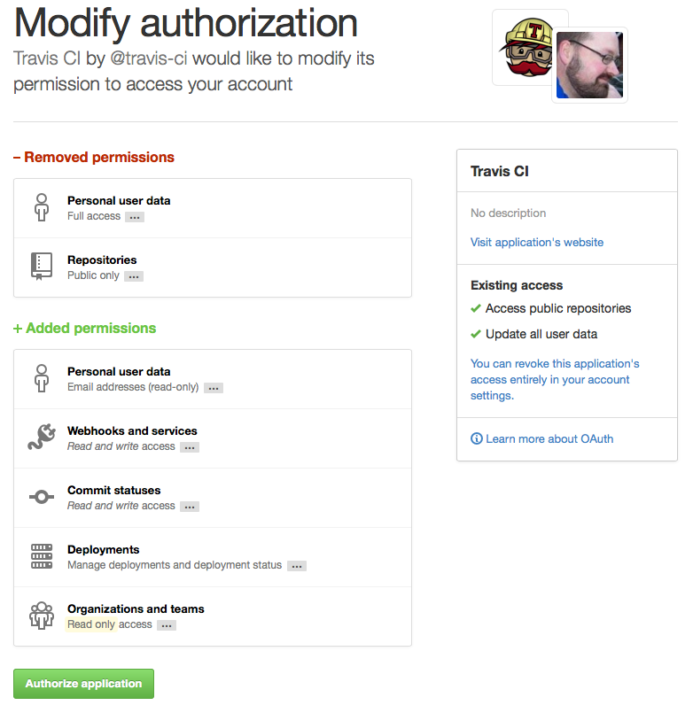
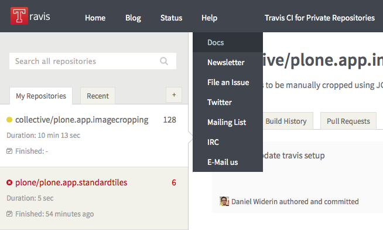
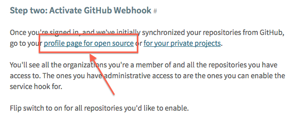

# Automate Tests with Travis CI

Tests are great. They prove that your code works the way you advertise it to
work. But the best tests in the world are no good unless you actually run
them.

Do you run your tests before checking in code?

Every time?

Yeah, I don’t either.

It’s hard to remember to run your tests every time. Even in the real world,
teams run into trouble when they fail to run tests before checking in changes.
So give up the _manual_ testing and reach for **automation** , the savior of
us all.

## Automation to the Rescue

Allow your repository to run your tests for you.

GitHub provides simple integration with [a service called Travis CI](https://travis-ci.org/.).

Travis leverages the power of [an automated build tool called Jenkins](http://jenkins-ci.org). This tool allows you to configure _jobs_ that
can involve pretty much all aspects of setting up software, including running
tests.

You can download and install `Jenkins` on your own, but unless you are a
development team with complex needs, it’s probably overkill to do so. `Travis CI` provides access to the test-running capabilities of `Jenkins` with a
minimum of fuss and difficulty.

### Getting Started 

<!-- NOTE: I think most of this section is out of date. -->

So long as your project _has tests_ that can be run with a command, Travis is
great for you. Let’s start with a simple example, a [FizzBuzz repository](https://github.com/nhuntwalker/fizzbuzz). You can fork and clone
your own copy if you’d like to play along.

The first step is to [sign in to Travis](https://travis-ci.org.). Luckily, you
can simply sign in using the account you already have with GitHub (no new
account required!).

[](_images/sign_in_to_github.png)

_Travis will request rights to your repository_

You’ll need to authorize Travis to allow it to access your repositories.

[](_images/help_docs.png)

_The docs link is found under the Help tab_

Once you’ve signed in, click on the _Help_ > _docs_ link in the top and then
click the big red _Get Started_ button.

[](_images/link_to_profile.png)

_profile page link_

The steps that are outlined on that page will tell you to go to your **profile
page**. The link there is the easiest way to do so. Click it.

[](_images/project_list.png)

_The repository list in TravisCI_

When the page loads, it will contain a list of all the repositories that you
have in your `GitHub` account. For each, there is an on/off switch. Find your
fizzbuzz repository and turn it on.

Once this is done, you need to let `GitHub` know that you want `Travis CI` to
have access to your repositories. You do this by enabling the **Travis Commit
Hook**.

In `GitHub`, find and enter your `fizzbuzz` repository. Find and click on the
`Settings` tab. On the left menu, click on the `Integrations & services` menu
item.

Check first to see if _Travis CI_ is already listed in the _Services_ pane on
that page. If so you can skip to  Configuring Travis below.

If not, you want to configure a third-party service. Click on the _Add
service_ button and find the **Travis CI** service in the long, alphabetical
list. Click it to open the settings for ` Travis CI` (it’ll ask for you to log
in).

You can configure a number of options, but to get started all you _have to_
provide is your **Travis Token**. You can get this from your ` Travis CI`
profile page by clicking on your username at the Travis CI website. Paste it
in the provided text box. You don’t need to provide the “Domain” field.

After you’ve pasted your token, check the active box, then click _Update
settings_.

## Configuring Travis

` Travis CI` needs to know how _your_ tests should be run. It does this using
a configuration file written in [YAML](http://www.yaml.org).

For a Python project there are a couple of things to set up:

  * You must inform Travis that your project uses Python.
  * You must inform Travis which versions of Python are used.
  * You must inform Travis what command to run to execute your tests.
  * You can tell Travis what extra software needs to be installed.

For the `fizzbuzz` project, we want to test in Python 2.7 and 3.6. We’ll also
need to provide teh command to be executed in order to run our tests.

Here’s what the `YAML` file will look like:

    
```yml
language: python
python:
  - "2.7"
  - "3.6"
# command to install dependencies
install:
  - pip install .
  - pip install -r requirements.txt
# command to run tests
script: py.test
```

Formatting is important, in particular for list entries like `python:`.

To set this up, we need to add a new file to our `fizzbuzz` repository with
that content.

    
```sh
(ENV) $ pwd
/Users/Nick/Documents/codefellows/courses/exercises/fizzbuzz

(ENV) $ touch .travis.yml

(ENV) $ subl .travis.yml
```

Once you’ve entered the above content into `.travis.yml`, you’re nearly there.
You’ve told `Travis CI` what it will need to build your project and test it.
But there’s still one thing missing, **requirements.txt``.

### Installing Python Packages

When we create a `virtualenv` for the `fizzbuzz` project, we need to install
our package and our package’s dependencies. `pip` can also be automated to a
degree by...

  * `pip install .`
  * `pip install -r requirements.txt`

### Running Your CI Tests

Now that you have all the pieces in place, you should be ready to roll. Add
the two new files you’ve created to your `fizzbuzz` repository, commit, and
push.

    
```sh
(ENV) $ git add .travis.yml requirements.txt

(ENV) $ git commit -m "Adding Travis CI integration"

(ENV) $ git push origin master
```

If all is well, you should be able to look at your main page in `Travis CI`
and see your tests start, run, and pass.

### Advertise Your Awesomeness

Now that you’ve got Travis CI running and you have your tests passing, let the
world know about it.

On the Travis page for this repository, click on the image next to the
`GitHub` icon that says (probably for you) `build unknown`.

A small window will pop up for you to copy the image for the `status` of your
repository into your `README.md`. By default you’re provided with just the
image URL. Click on the dropdown menu and select `Markdown` for the proper
markdown code to paste into your `README`.

**Add the badge to the top of your README.md** to display the test results
from ` Travis CI`. It’ll update as your tests continue to pass or fail. Keep
in mind that **the badge itself is tied to ONE branch**.

And that’s it!

## Extras

You’ll find that when you try to hook TravisCI up to a web app that uses a
Postgres databse, it will fail. This is because it’s looking for a database
that doesn’t exist, as well as a service that doesn’t exist. [These Travis
docs](https://docs.travis-ci.com/user/database-setup/#PostgreSQL) will show
you how to integrate Postgres into your Travis tests.

On other GitHub repositories, you may have seen Coverage badges in addition to
Travis badges. That is not inherently a part of your Travis integration. It
can, however be a part of your repository. Check out [these
docs](https://github.com/z4r/python-coveralls) and the [coveralls
website](https://coveralls.io/) for information on how to implement coverage
badges into your repository. You will need to sign up for an account there and
enable your repo in much the same way as with Travis.

For a working implementation of both the TravisCI badge and the coverage
badge, check the `master` branch of the [expense tracker
repository](https://github.com/nhuntwalker/expense_tracker).

## Next Steps

For your assignments, from here on, repeat this process. This means that
**every repository that you make after this point should have Travis
integration**. You won’t need the coverage badge, but it’d be awesome to see
it.

